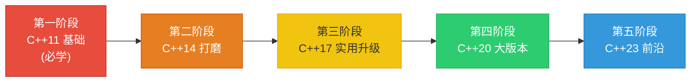

# LearnCpp — 现代 C++ 完整教学示例

> 覆盖 C++11 到 C++23 的 **95 个独立可编译示例**，每个特性一个文件，循序渐进。

---

## 项目概览

本项目提供从 C++11 到 C++23 的完整特性教学，涵盖语言核心、标准库、并发编程等各个方面。每个特性都配有独立可编译的示例代码和详细的中文文档说明。

| 标准 | `.cpp` 文件数 | 文档 |
|------|:------------:|------|
| C++11 | 33 | [C++11 新特性概览](cpp11/index.md) |
| C++14 | 11 | [C++14 新特性概览](cpp14/index.md) |
| C++17 | 16 | [C++17 新特性概览](cpp17/index.md) |
| C++20 | 23 | [C++20 新特性概览](cpp20/index.md) |
| C++23 | 12 | [C++23 新特性概览](cpp23/index.md) |
| **合计** | **95** | **5 份详细文档** |

---

## 构建方式

### 构建全部示例

```bash title="构建全部"
cmake -B build -G "MinGW Makefiles" && cmake --build build
```

### 仅构建某个标准版本

```bash title="仅构建 C++11"
cmake -B build -DBUILD_CPP11=ON -DBUILD_CPP14=OFF -DBUILD_CPP17=OFF -DBUILD_CPP20=OFF -DBUILD_CPP23=OFF
cmake --build build
```

### 运行单个示例

```bash title="运行示例"
./build/cpp11/cpp11_01_auto_and_decltype
```

:::tip 快速开始
只需三步即可运行第一个示例：配置 CMake、构建项目、运行可执行文件。
:::

---

## 学习路线建议

下面的 Mermaid 图展示了推荐的学习路径：



### 第一阶段：C++11 基础（必学）

:::info 为什么从 C++11 开始？
C++11 是现代 C++ 的起点，几乎所有后续特性都建立在它之上。掌握 C++11 是学习现代 C++ 的基石。
:::

**建议顺序：**

| 优先级 | 示例 | 特性 | 说明 |
|:------:|------|------|------|
| 1 | `01_auto_and_decltype` | 类型推导 | 基础中的基础 |
| 2 | `02_range_based_for` | 范围 for | 日常最常用 |
| 3 | `03_lambda_expressions` | Lambda | 现代 C++ 标志 |
| 4 | `40_smart_pointers` | 智能指针 | **核心** |
| 5 | `11_move_semantics` | 移动语义 | **核心** |
| 6 | `12_perfect_forwarding` | 右值引用与转发 | 深入理解移动语义 |
| 7 | 04-19 | 其余语言核心特性 | 按编号顺序 |
| 8 | 41-46 | 容器与工具 | 标准库扩展 |
| 9 | 70-74 | 并发 | 多线程编程 |

### 第二阶段：C++14 打磨

C++14 是对 C++11 的小幅改进。

**建议顺序：** 按编号 01-11 顺序阅读即可。

### 第三阶段：C++17 实用升级

:::tip 核心特性
重点关注 **词汇类型**（optional/variant/any）和 **string_view**，它们是日常开发中使用频率最高的特性。
:::

**建议顺序：**

| 优先级 | 示例 | 特性 | 说明 |
|:------:|------|------|------|
| 1 | `01_structured_bindings` | 结构化绑定 | 便捷的解包语法 |
| 2 | `05_constexpr_if` | if constexpr | 编译期分支 |
| 3 | `40-42` | optional/variant/any | **核心词汇类型** |
| 4 | `43_string_view` | string_view | **核心** |
| 5 | `50_filesystem` | filesystem | 跨平台文件操作 |
| 6 | 其余 | 其余特性 | 按编号顺序 |

### 第四阶段：C++20 大版本

:::info 重要版本
C++20 是继 C++11 后最大的标准更新，引入了四大核心特性：Concepts、Ranges、Coroutines、Modules。
:::

**建议顺序：**

| 优先级 | 示例 | 特性 | 说明 |
|:------:|------|------|------|
| 1 | `01-04` | Concepts | **核心** |
| 2 | `20-22` | Ranges | **核心** |
| 3 | `05_spaceship_operator` | 三路比较 | 大幅减少样板代码 |
| 4 | `30-31` | 协程 | 高级特性 |
| 5 | `41_format` | std::format | 现代格式化 |
| 6 | 其余 | 其余标准库特性 | 按编号顺序 |

### 第五阶段：C++23 前沿

:::warning 编译器支持
C++23 正在逐步获得编译器支持，部分特性可能需要较新版本的编译器。
:::

**建议顺序：**

| 优先级 | 示例 | 特性 | 说明 |
|:------:|------|------|------|
| 1 | `40_expected` | std::expected | **核心** |
| 2 | `41_optional_monadic` | optional monadic | 函数式操作 |
| 3 | 其余 | 其余特性 | 按编号顺序 |

---

## 总目录

### C++11（33 个示例）

| 编号 | 文件 | 特性 |
|:----:|------|------|
| 01 | `01_auto_and_decltype.cpp` | auto 类型推导、decltype |
| 02 | `02_range_based_for.cpp` | 范围 for 循环 |
| 03 | `03_lambda_expressions.cpp` | Lambda 表达式 |
| 04 | `04_nullptr.cpp` | nullptr 关键字 |
| 05 | `05_enum_class.cpp` | 强类型枚举 enum class |
| 06 | `06_uniform_initialization.cpp` | 统一初始化 {} |
| 07 | `07_default_delete.cpp` | = default、= delete |
| 08 | `08_override_final.cpp` | override、final |
| 09 | `09_delegating_constructors.cpp` | 委托构造函数 |
| 10 | `10_inheriting_constructors.cpp` | 继承构造函数 |
| 11 | `11_move_semantics.cpp` | 移动语义 |
| 12 | `12_perfect_forwarding.cpp` | 完美转发 |
| 13 | `13_noexcept.cpp` | noexcept |
| 14 | `14_static_assert.cpp` | static_assert |
| 15 | `15_raw_string_literals.cpp` | 原始字符串字面量 |
| 16 | `16_unicode_literals.cpp` | Unicode 字面量 |
| 17 | `17_user_defined_literals.cpp` | 用户自定义字面量 |
| 18 | `18_type_aliases.cpp` | using 类型别名 |
| 19 | `19_alignof_alignas.cpp` | alignof、alignas |
| 20 | `20_variadic_templates.cpp` | 可变参数模板 |
| 21 | `21_constexpr.cpp` | constexpr |
| 22 | `22_type_traits.cpp` | type_traits |
| 23 | `23_initializer_list.cpp` | initializer_list |
| 40 | `40_smart_pointers.cpp` | 智能指针 |
| 41 | `41_tuple.cpp` | tuple |
| 42 | `42_array.cpp` | std::array |
| 43 | `43_unordered_containers.cpp` | 无序容器 |
| 44 | `44_function_and_bind.cpp` | function、bind |
| 45 | `45_forward_list.cpp` | forward_list |
| 46 | `46_ref_wrapper.cpp` | reference_wrapper |
| 60 | `60_string_conversions.cpp` | 字符串转换 |
| 61 | `61_regex.cpp` | 正则表达式 |
| 70 | `70_thread.cpp` | 线程 |
| 71 | `71_mutex_and_locks.cpp` | 互斥锁 |
| 72 | `72_condition_variable.cpp` | 条件变量 |
| 73 | `73_future_promise.cpp` | future/promise |
| 74 | `74_atomic.cpp` | 原子操作 |
| 80 | `80_chrono.cpp` | chrono 时间库 |
| 81 | `81_random.cpp` | 随机数 |
| 90 | `90_attributes.cpp` | 属性 |

### C++14（11 个示例）

| 编号 | 文件 | 特性 |
|:----:|------|------|
| 01 | `01_generic_lambdas.cpp` | 泛型 Lambda |
| 02 | `02_return_type_deduction.cpp` | 返回类型推导 |
| 03 | `03_variable_templates.cpp` | 变量模板 |
| 04 | `04_binary_literals_separators.cpp` | 二进制字面量、数字分隔符 |
| 05 | `05_relaxed_constexpr.cpp` | 放松的 constexpr |
| 06 | `06_make_unique.cpp` | make_unique |
| 07 | `07_deprecated_attribute.cpp` | [[deprecated]] |
| 08 | `08_shared_timed_mutex.cpp` | 读写锁 |
| 09 | `09_integer_sequence.cpp` | integer_sequence |
| 10 | `10_exchange.cpp` | std::exchange |
| 11 | `11_quoted.cpp` | std::quoted |

### C++17（16 个示例）

| 编号 | 文件 | 特性 |
|:----:|------|------|
| 01 | `01_structured_bindings.cpp` | 结构化绑定 |
| 02 | `02_if_switch_init.cpp` | if/switch 初始化 |
| 03 | `03_ctad.cpp` | 类模板参数推导 |
| 04 | `04_fold_expressions.cpp` | 折叠表达式 |
| 05 | `05_constexpr_if.cpp` | if constexpr |
| 06 | `06_inline_variables.cpp` | inline 变量 |
| 07 | `07_nested_namespaces.cpp` | 嵌套命名空间 |
| 08 | `08_has_include.cpp` | \_\_has\_include |
| 40 | `40_optional.cpp` | std::optional |
| 41 | `41_variant.cpp` | std::variant |
| 42 | `42_any.cpp` | std::any |
| 43 | `43_string_view.cpp` | string_view |
| 44 | `44_byte.cpp` | std::byte |
| 45 | `45_invoke_apply.cpp` | invoke、apply |
| 50 | `50_filesystem.cpp` | filesystem |
| 55 | `55_parallel_algorithms.cpp` | 并行算法 |
| 56 | `56_clamp_gcd_lcm.cpp` | clamp、gcd、lcm |
| 90 | `90_attributes.cpp` | 属性 |

### C++20（23 个示例）

| 编号 | 文件 | 特性 |
|:----:|------|------|
| 01 | `01_concepts_basics.cpp` | Concepts 基础 |
| 02 | `02_concepts_advanced.cpp` | Concepts 进阶 |
| 03 | `03_requires_expressions.cpp` | requires 表达式 |
| 04 | `04_abbreviated_templates.cpp` | 简写函数模板 |
| 05 | `05_spaceship_operator.cpp` | 三路比较 `<=>` |
| 06 | `06_designated_initializers.cpp` | 指定初始化器 |
| 07 | `07_consteval.cpp` | consteval |
| 08 | `08_constinit.cpp` | constinit |
| 09 | `09_template_lambdas.cpp` | 模板 Lambda |
| 10 | `10_aggregate_parens_init.cpp` | 圆括号聚合初始化 |
| 20 | `20_ranges_basics.cpp` | Ranges 基础 |
| 21 | `21_ranges_views.cpp` | Ranges 视图 |
| 22 | `22_ranges_custom.cpp` | 自定义 Range |
| 30 | `30_coroutines_basics.cpp` | 协程基础 |
| 31 | `31_coroutines_generator.cpp` | 协程 Generator |
| 40 | `40_span.cpp` | std::span |
| 41 | `41_format.cpp` | std::format |
| 42 | `42_calendar_timezone.cpp` | 日历与时区 |
| 43 | `43_source_location.cpp` | source_location |
| 44 | `44_bit_cast.cpp` | bit_cast |
| 45 | `45_math_constants.cpp` | 数学常量 |
| 46 | `46_string_operations.cpp` | starts_with/ends_with |
| 47 | `47_contains.cpp` | contains() |
| 70 | `70_jthread.cpp` | jthread |
| 71 | `71_barrier_latch.cpp` | barrier、latch |
| 90 | `90_attributes.cpp` | 属性 |

### C++23（12 个可编译示例 + 文档说明）

| 编号 | 文件 | 特性 |
|:----:|------|------|
| 01 | `01_if_consteval.cpp` | if consteval |
| 02 | `02_multidim_subscript.cpp` | 多维下标运算符 |
| 03 | `03_size_t_literal.cpp` | size_t 字面量 |
| 05 | `05_lambda_improvements.cpp` | Lambda 改进 |
| 40 | `40_expected.cpp` | std::expected |
| 41 | `41_optional_monadic.cpp` | optional monadic |
| 42 | `42_move_only_function.cpp` | move_only_function |
| 43 | `43_to_underlying.cpp` | to_underlying |
| 44 | `44_unreachable.cpp` | std::unreachable |
| 61 | `61_stacktrace.cpp` | stacktrace |
| 70 | `70_byteswap.cpp` | byteswap |
| 90 | `90_attributes.cpp` | [[assume]] |

**仅文档说明的特性**（见 [C++23 详细文档](cpp23/index.md)）：
- Deducing this
- std::print/println
- std::mdspan
- std::flat_map/flat_set
- std::generator
- static operator()
- std::ranges 新增视图
